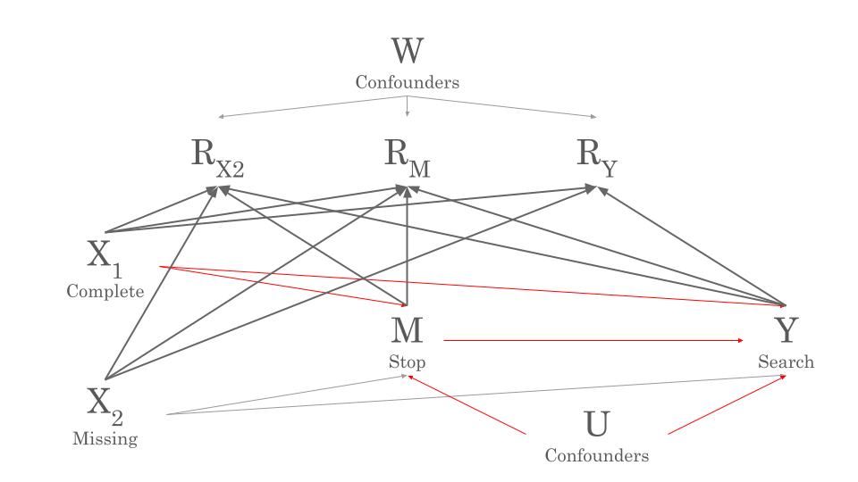

# Measuring the Impact of Missingness on Racial Bias in Traffic Stop Data

Official implementation for
<pre>
<b>Measuring the Impact of Missingness on Racial Bias in Traffic Stop Data</b>
<a href="https://saatvikkher.github.io/">Saatvik Kher</a> and <a href="https://hardin47.netlify.app/">Johanna Hardin</a>
<a href="https://arxiv.org/abs/2505.18281">arxiv.org/abs/2505.18281</a> 
</pre>

<p align="center">
 
</p>


## Setup environment

We use R Studio (2024.04.2+764).

We user docker to run our sensitivity analysis for bounds on the ATE (Knox et al., 2020).

```bash
sudo docker run -p 8888:8888 -it gjardimduarte/autolab:v4
```

Install the repo:

```bash
git clone https://github.com/saatvikkher/missing-traffic
cd missing-traffic
```

All datasets can be found at [https://openpolicing.stanford.edu/data/](https://openpolicing.stanford.edu/data/). We download the datasets as RMD files and save them in `data/`

## Replicate Results
### Diagnosing non-MCAR (Section 3)

- `dCMR_func.R` contains the R function for calculating dCMR for different choices of explanatory variable.
- `diagnosing_nonMCAR_plots.R` reproduces Figures 2, 4, 5, 6, 7, and 8

### Outcome Test (Section 4.1)

- `outcome_test_plots.R` reproduces Figures 9, 11-15 for the outcome test
- `outcome_test_disparity_table.R` reproduces Table 4

The files can also be run in parallel using `outcome_test_plots_parallel.R`

### Bounds on ATE (Section 4.2)

- Run the file `autobounds_script.py` in the Docker container to produce files in `ate_results/`.
- `ate_plots.R` reproduces Figures 10, 16-21
